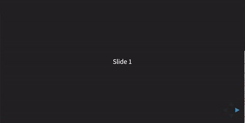

# reveal.js - Coursemod
Giving a presentation is great, but sometimes (or most of the times in my case) I also want to publish my presentation for my audience to review it later.
By doing this a lot of the context might get lost (not everything you say in class is on the presentation), but not anymore!

With this plugin you are able to start your presentation with the speaker notes next to it.



##Installation
First of all download the `coursemod` folder (javascript and css) and place it in `plugin/`

The second thing to do, is include it as a dependency in your initialization. And enable it.

```javascript
Reveal.initialize({
    ...
    coursemod: {
    	enabled: true
    },
    ...
    dependencies: [
        ...
        { src: 'plugin/coursemod/coursemod.js', async: true}
    ]
});
```

That's all for installation

##Configuration
As you have already seen in the installation part I have added an extra config block for this plugin. This block needs to be passed along to `Reveal.initialize()`.

```javascript
coursemod: {
	enabled: true, //enable or disable the plugin, default to false
	shown: true //immediatly show the course notes view, this defaults to true if not present.
}
```
###Overriding the shown config
You can override the `shown` parameter on a slide to slide basis. You just have to add `data-coursemod-shown = "true"` (or `false`) to the slide (`<section>`) you want to override and it will be done.
##Usage in presentation
If you want to toggle the coursemode, I have also added an event to the `c` key. so pressing `c` with the plugin enabled will show or hide the notes view.
